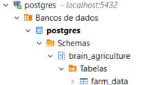
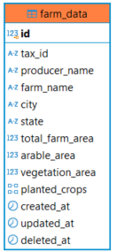

<!-- PROJECT LOGO -->
<br />
<p align="center">
  <h2 align="center">Brain Agriculture</h2>
</p>

<!-- ABOUT THE PROJECT -->

## :notebook_with_decorative_cover: Sobre o projeto

Este projeto consiste em um sistema de cadastro de produtores rurais, permitindo a gestão de dados como CPF/CNPJ, nome do produtor, nome da fazenda, localização e áreas da propriedade. O sistema valida os dados inseridos e oferece uma interface de Dashboard com gráficos para visualização de informações..

### Tecnologias Utilizadas

O projeto foi criado usando as tecnologias:

- [TypeScript]
- [Node.Js]
- [PostgreSQL]
- [Jest]

### Regras de Negócio

- Os usuários devem ser capazes de cadastrar, editar e excluir produtores rurais;
- O sistema deve garantir que o <i>CPF</i> ou <i>CNPJ</i> seja válido;
- A soma da área agricultável e da área de vegetação não deve ser maior que a área total da fazenda;
- Um produtor pode plantar mais de uma cultura em sua fazenda;

<!-- GETTING STARTED -->

## :book: Requisitos de negócio

- O usuário deverá ter a possibilidade de cadastrar, editar, e excluir produtores rurais.
- O sistema deverá validar CPF e CNPJ digitados incorretamente.
- A soma de área agrícultável e vegetação, não deverá ser maior que a área total da fazenda
- Cada produtor pode plantar mais de uma cultura em sua Fazenda.
- A plataforma deverá ter um Dashboard que exiba:
- Total de fazendas em quantidade
- Total de fazendas em hectares (área total)
- Gráfico de pizza por estado.
- Gráfico de pizza por cultura.
- Gráfico de pizza por uso de solo (Área agricultável e vegetação)

### Instalando

1. Clonar o repositório

```sh
   git clone https://github.com/GabiTavaresV/brain-agriculture.git
```

2. Instalando os pacotes

```sh
    npm install
```

4. Configurar banco

Crie uma conexão com o postgres, com a seguinte estrutura:



Dados da tabela:



sugestão da criação da tabela no banco:

```
CREATE TABLE farm_data (
    id SERIAL PRIMARY KEY,
    tax_id VARCHAR(14) NOT NULL,
    producer_name VARCHAR(255) NOT NULL,
    farm_name VARCHAR(255) NOT NULL,
    city VARCHAR(100) NOT NULL,
    state VARCHAR(2) NOT NULL,
    total_farm_area NUMERIC NOT NULL,
    arable_area NUMERIC NOT NULL,
    vegetation_area NUMERIC NOT NULL,
    planted_crops TEXT[] NOT NULL,
    created_at TIMESTAMP DEFAULT CURRENT_TIMESTAMP,
    updated_at TIMESTAMP DEFAULT CURRENT_TIMESTAMP ON UPDATE CURRENT_TIMESTAMP,
    deleted_at TIMESTAMP
);
```

3. Executar a API localmente

```sh
    npm run start:dev
```

### Configurando

1. Criar um arquivo na raiz do projeto, chamado [.env].

2. Copiar o conteúdo do arquivo [.env.example] e setar com as configurações do seu banco de dados.

<!-- USAGE EXAMPLES -->

## :electric_plug: Utilizando a API

### Endpoints

O usuário tem acesso aos seguintes endpoints:

- Cadastro de produtores rurais
- Edição de produtores rurais
- Exclusão de produtores rurais
- Exibir totais para o Dashboard

#### Cadastra um novo produtor rural

```sh
    endpont local: POST http://localhost:3000/agriculture/register/rural-producer
```

Body de exemplo

```json
{
  "taxId": "12345678901",
  "producerName": "João da Silva",
  "farmName": "Fazenda Boa Vista",
  "city": "Ribeirão Preto",
  "state": "SP",
  "totalFarmArea": 1000,
  "arableArea": 700,
  "vegetationArea": 200,
  "plantedCrops": ["Soja", "Milho"]
}
```

#### Atualiza um novo produtor rural

```sh
    endpont local: PATCH http://localhost:3000/agriculture/update/rural-producer/:id
```

Body de exemplo

```json
{
  "producerName": "João da Silva",
  "farmName": "Fazenda Boa Vista",
  "totalFarmArea": 1200,
  "arableArea": 800,
  "vegetationArea": 300
}
```

#### Excluí um novo produtor rural

```sh
    endpont local: DELETE http://localhost:3000/agriculture/delete/rural-producer/:id
```

#### Lista total de fazendas em quantidade

```sh
    endpont local: GET http://localhost:3000/dashboard/total-farms
```

#### Lista total de fazendas em hectares (área total)

```sh
    endpont local: GET http://localhost:3000/dashboard/total-area
```

#### Lista total de fazendas por estado

```sh
    endpont local: GET http://localhost:3000/dashboard/states-pie-chart
```

#### Lista total de fazendas por cultura

```sh
    endpont local: GET http://localhost:3000/dashboard/crops-pie-chart
```

#### Lista total de fazendas por por uso de solo (Área agricultável e vegetação)

```sh
    endpont local: GET http://localhost:3000/dashboard/land-use-pie-chart
```

<!-- CONTACT -->

## :womens: Autor

- [Gabriela Tavares](https://github.com/GabiTavaresV)
